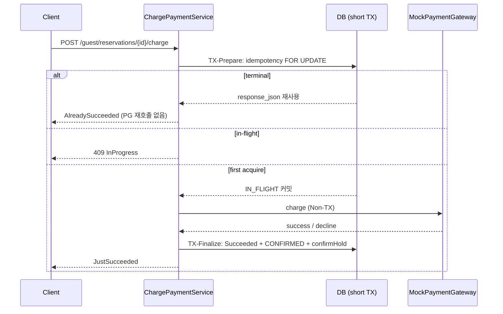

# Charge 시퀀스 (ADR-003)

이중청구가 안 나는 이유: **같은 Intent 키**로 짧게 잠그고, **PG는 커밋된 상태 사이**에서만 호출한다.

| 위반 | 결과 |
|------|------|
| `@Transactional` 안 PG | 커넥션 점유 · 롤백해도 PG 청구 남음 → **금지** |
| 클라 UUID를 멱등 키로 | 연타마다 새 키 → 이중청구 → **금지** (키는 `pay:{reservationId}:CHARGE_FULL`) |
